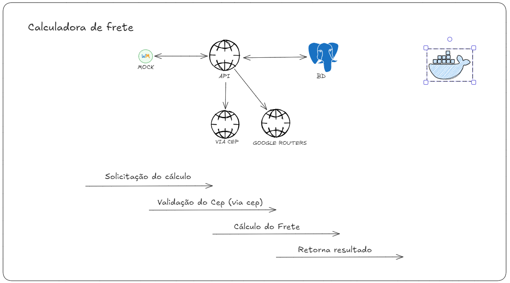

# API de Cálculo de Frete
###### Desafio santander

Este projeto tem como objetivo fornecer uma API para calcular o frete de mercadorias, levando em consideração cubagem, peso e valor do produto. A API utiliza o Brasil API para validação de CEPs e o Google Maps Distance Matrix para calcular distâncias entre pontos de entrega.

## Sumário
1. [Descrição do Projeto](#descrição-do-projeto)
2. [Considerações](#considerações)
3. [Requisitos](#requisitos)
4. [Instalação](#instalação)
5. [Como usar](#como-usar)
6. [Desenho da Arquitetura](#desenho-da-arquitetura)
7. [Contribuições](#contribuições)
8. [Licença](#licença)

## Considerações

A aplicação leva em conta os seguintes pontos:
1. Transporte terrestre.
2. Capacidade de 300 kg/m³.
3. Validação de CEP através da integração com a API do Brasil API: [BrasilAPI](https://viacep.com.br/).
4. Cálculo da rota utilizando a integração com o Google Maps (API Distance Matrix): [Google Maps Distance Matrix](https://developers.google.com/maps/documentation/distance-matrix/start?hl=pt-br#maps_http_distancematrix_start-txt).

## Requisitos

- Java 21
- Docker
- PostgreSQL
- WireMock
- Google Maps API Key

## Instalação

1. Clone o repositório:
   ```bash
   git clone https://github.com/RafaJMoraes/santander-nava.git
2. Configure o ambiente com Docker:
   ```bash
   docker compose up -d
3. Execute a aplicação:
   ```bash
   ./mvnw spring-boot:run

## Como usar
1. Instale o docker:
2. Rode o comando:
   ```bash
   docker compose up --build


### Desenho da Arquitetura


### Composição da Arquitetura

O diagrama acima demonstra a arquitetura da aplicação, onde a API realiza chamadas externas ao Brasil API para validação de CEPs e ao Google Maps Distance Matrix para cálculo da rota. O banco de dados PostgreSQL é utilizado para armazenar logs dos endereços  e a integração com o WireMock permite a simulação de respostas durante os testes.

### Contribuições
Não será aceito contribuições nesse momento.

### Licença

Este projeto foi desenvolvido exclusivamente para o desafio Santander-Nava e não está disponível para uso comercial ou redistribuição sem a autorização prévia. Para mais informações, entre em contato com o organizador do desafio ou com o(s) autor(es).
###### Propriedade Intelectual
Todo o conteúdo, incluindo o código-fonte, design, e documentação, é de propriedade intelectual do autor. Qualquer uso ou redistribuição deste material, parcial ou total, sem a devida autorização está estritamente proibido.


